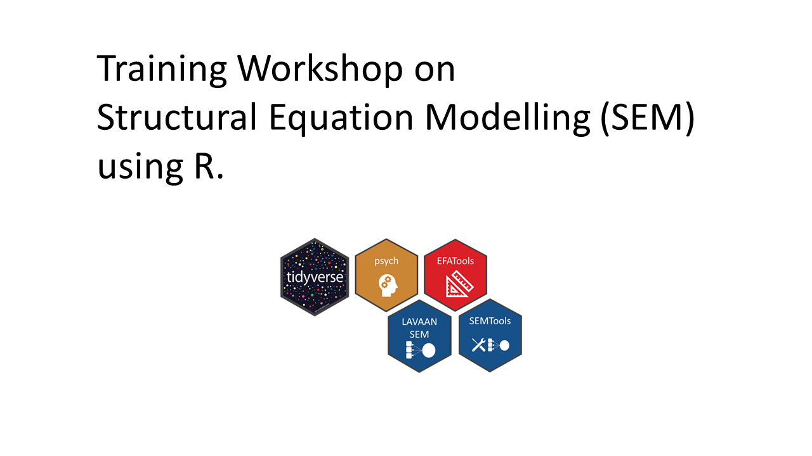

# 
 List of R trainings 

## [Training workshop on the Basics of Structural Equation Modelling (SEM) using R.](https://chris-allones.github.io/R-trainings/SEM/index.html)

 

## [Training workshop on Data Visualization using ggplot2 in R](https://chris-allones.github.io/R-trainings/data-viz-ggplot2/index.html)

