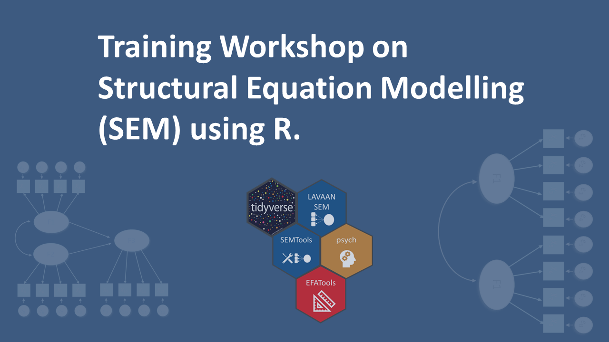

# 
 [Training Workshop on the Basics of Structural Equation Modelling (SEM) using R.](https://chris-allones.github.io/R-trainings/SEM-UP/index.html) 

## Outline

### [Session 1: Intro to R and basic data wrangling](https://chris-allones.github.io/R-trainings/SEM-UP/presentation/00_intro_r/introR.html)

- R objects and packages
- Reading data into R
- Basic data wrangling with tidyverse

### [Session 2: Exploratory Factor Analysis (EFA)](https://chris-allones.github.io/R-trainings/SEM-UP/presentation/01_efa/efa_presentation.html)

- Objectives of factor analysis
- Designing an EFA
- Assumptions in EFA
- Deriving factors and assessing overall fit
- Interpreting factor

### [Session 3: CFA and SEM](https://chris-allones.github.io/R-trainings/SEM-UP/presentation/02_cfa_sem/cfa_sem_presentation.html)

- CFA-SEM overview
- CFA-SEM with Lavaan package
- Defining constructs
- Developing the overall measurement model
- Assessing measurement model validity
- Specifying the structural model
- Assessing the structural model validity

### [Session 4: Case study](https://chris-allones.github.io/R-trainings/SEM-UP/presentation/03_case_study/03_case_study.html)

In this session, we will be replicating the results of a study entitled "Young people's perceived service quality and environmental performance of hybrid electric bus service" by Munim and Noor (2020). You can access the article by clicking this [DOI link](https://doi.org/10.1016/j.tbs.2020.03.003). The idea of this session is to be familiar with how SEM results are presented in a publishable format.
