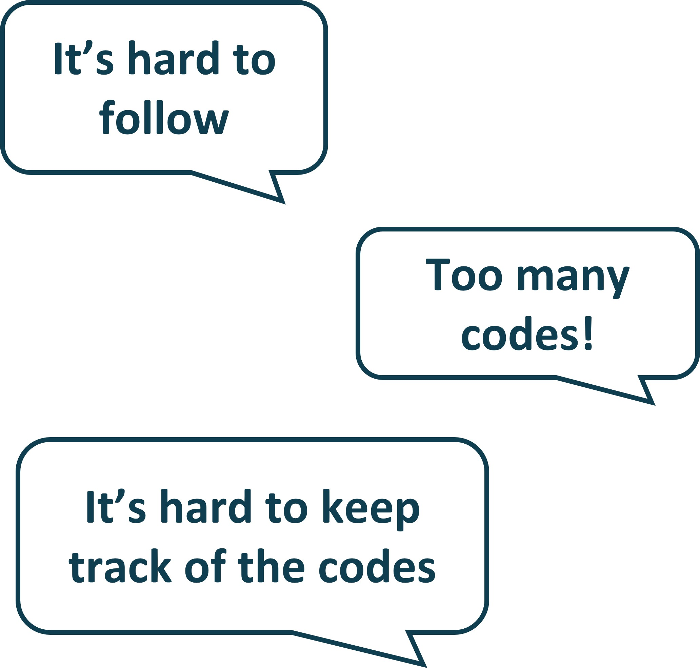
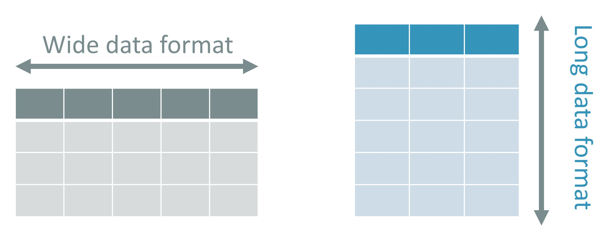
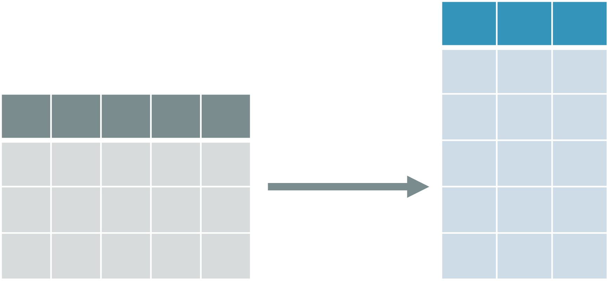
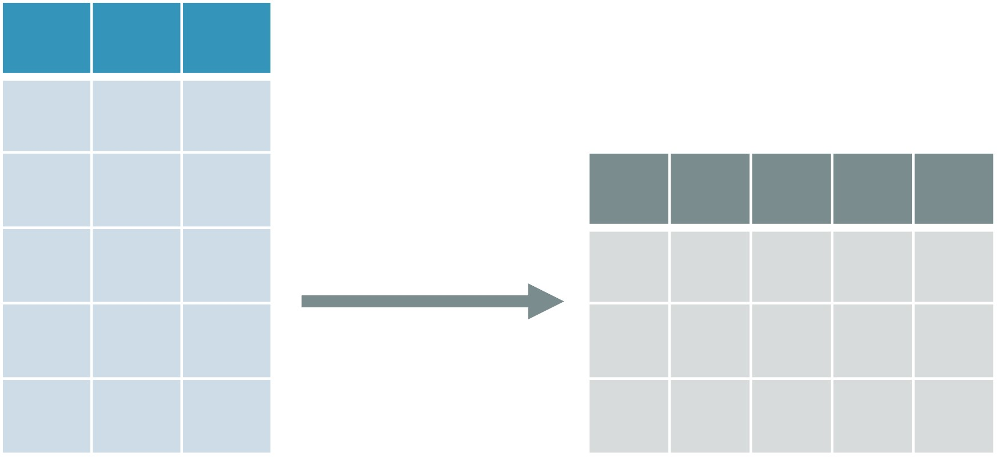

layout: true

```{r meta, echo=FALSE}
# setwd("D:/OneDrive - KMITL/Documents/GitHub-repo/training-data-viz/01_intro_data_wrangling")

# libraries
pacman::p_load(knitr, tidyverse, janitor, metathis)

xaringanExtra::use_share_again()
xaringanExtra::style_share_again(share_buttons = c("twitter", "facebook", "linkedin"))

meta() %>% 
  meta_name("github-repo" = "chris-allones/training-data-viz") %>% 
  meta_social(
    title = "Data viz with ggplot2",
    description = "Training Workshop on Data Visualization using ggplot2 in R.",
    url = "https://chris-allones.github.io/data-viz-ggplot2/index.html",
    image = "https://chris-allones.github.io/data-viz-ggplot2/images/preview.png",
    og_type = "website",
    og_author = "Christopher Llones",
    twitter_card_type = "summary_large_image",
    twitter_creator = "@Topenomics",
    twitter_site = "@Topenomics"
  )

```

```{r setup, echo=FALSE}

options(htmltools.dir.version = FALSE,
        knitr.table.format = "html")

knitr::opts_chunk$set(
  fig.width=9, fig.height=3.5, fig.retina=3,
  out.width = "100%",
  cache = FALSE,
  echo = TRUE,
  message = FALSE, 
  warning = FALSE,
  hiline = TRUE,
  comment = "",
  fig.retina = 3
)

```

```{r xaringan-themer, echo=FALSE, warning=FALSE}
library(xaringanthemer)

xaringanExtra::use_share_again()
xaringanExtra::style_share_again(share_buttons = c("twitter", "facebook", "linkedin"))
xaringanExtra::use_tile_view()
xaringanExtra::use_extra_styles(hover_code_line = TRUE,
                                mute_unhighlighted_code = FALSE)

xaringanExtra::use_animate_css()
xaringanExtra::use_animate_all("fade")

style_duo_accent(
  primary_color = "#073b4c",
  secondary_color = "#2a9d8f",
  inverse_background_color = "#073b4c",
  inverse_header_color = "#fff",
  
  # title_slide_background_color = "#073b4c",
  title_slide_background_image = "img/background.jpg",
  title_slide_text_color = "#212529",
  text_font_size = "1.1rem"
)


```


---

## Topics

+ R objects and packages

+ Reading data into R

+ Basic data wrangling with `dplyr`

+ Reshaping data
  
+ Basic management of data types

  + text data (string)
  
  + categorical data (factor)
  
  + date data
  
---

### It's normal to struggle but it gets better and exciting!


```{r echo=FALSE, out.width="80%", fig.align='center'}
knitr::include_graphics("img/r_first_then_new.png")
```

.fifty[Illustration adapted from [Allison Horst](https://twitter.com/allison_horst)]


---

class: middle center

# R Objects and packages
----

---

## R Objects

.leftcol60[
+ You can consider R objects as "*saving information*"

+ e.g., text, number, matrix, vector, dataframe.

+ In other words everything in R is an object.
]

.rightcol40[
```{r echo=FALSE, out.width="60%"}
knitr::include_graphics("img/r_objects.gif")
```
]


---

## R Objects

+ Objects are assigned a value using **`<-`**

.leftcol[
.details[
```{r}
a1 <- 10
print(a1)
```
]

.details[
```{r}
a2 <- 20
a2
```
]

.details[
```{r}
a3 <- c(10, 20, 30)
a3
```
]
]

.rightcol[

.details[
```{r}
a1 * a2
```
]

.details[
```{r}
st_name <- "christopher"
st_age <- 23
st_sex <- "male"

student <- c(st_name, st_age, st_sex)
student
```
]
]

---

## R packages

.leftcol60[
+ Collection of functions that load into your working environment.

+ It contain code that other R users have prepared for the community.

+ Installing packages

```{r eval=FALSE}
install.packages("tidyverse")
```

+ Loading packages

```{r eval=FALSE}
library(tidyverse)
```

]

.rightcol40[

```{r echo=FALSE, fig.align='right', out.width="70%"}
knitr::include_graphics("img/package.gif")
```
]


---

class: middle center

# Reading data into R
----

---

## Importing data

+ SPSS, Stata, SAS files: [haven package](https://haven.tidyverse.org/)

+ Excel files: [readxl package](https://readxl.tidyverse.org/)

+ CSV files: [readr package](https://readr.tidyverse.org/)


---

## Reading data into R

#### SPSS, Stata & SAS using [haven package](https://haven.tidyverse.org/)

.leftcol60[

```{r eval=FALSE}
library(haven)
```

```{r eval=FALSE}
# SPSS
read_sav("path/data.sav")
```

```{r eval=FALSE}
# Stata
read_dta("path/data.dta")
```

```{r eval=FALSE}
# SAS
read_sas("path/data.sas7bdat")
```
]

.rightcol40[
```{r echo=FALSE, fig.align='center',out.width="40%"}
knitr::include_graphics("img/haven.png")
```
]

---

## Reading data into R

#### Excel files using [readxl package](https://readxl.tidyverse.org/)

.leftcol60[

```{r eval=FALSE}
library(readxl)
read_excel("path/dataset.xls")
```

```{r echo=FALSE}
dataset_xl_sample <- readxl::readxl_example("datasets.xlsx")
readxl::read_excel(dataset_xl_sample)

```
]

.rightcol40[
```{r echo=FALSE, fig.align='center',out.width="40%"}
knitr::include_graphics("img/readxl.png")
```
]

---

## Reading data into R

#### CSV files using [readr package](https://readr.tidyverse.org/)

.leftcol60[
```{r eval=FALSE}
install.packages("readr")
library(readr)
```

```{r eval=FALSE}
# comma separated (CSV) files
read_csv("path/data.csv")
```

```{r eval=FALSE}
# tab separated files
read_tsv("path/data.tsv")
```

```{r eval=FALSE}
# general delimited files
read_delim("path/data.delim")
```
]

.rightcol40[
```{r echo=FALSE, fig.align='center',out.width="40%"}
knitr::include_graphics("img/readr.png")
```
]


---

class: middle center

# Basic data wrangling with `dplyr`
----


---
class: middle center

```{r echo=FALSE, out.width="30%"}
knitr::include_graphics("img/tidyverse.png")
```

# Tidyverse

---

## What is a tidyverse?

A collection of R packages designed for data science.

All packages share an underlying philosophy, grammar, and data structure.

<center>

</center>

---

## Tidyverse :: tidy data

<center>

</center>

.fifty[Artist: [Allison Horst](https://github.com/allisonhorst)]

---

## Tidyverse :: tidy data

<center>

</center>

.fifty[Artist: [Allison Horst](https://github.com/allisonhorst)]

---

class: middle center

## Data wrangling using `dplyr`

<center>

</center>

.fifty[Artist: [Allison Horst](https://github.com/allisonhorst)]

---

## `dplyr`
.leftcol[
**Overview**

+ `select()` picks variables based on their names

+ `mutate()` adds new variables

+ `filter()` picks cases based on their values

+ `summarise()` reduces multiple values down to a single summary

+ `arrange()` change the ordering of the rows

see `dplyr` [cheatsheets](https://github.com/rstudio/cheatsheets/blob/master/data-transformation.pdf)
]

.rightcol[
```{r echo=FALSE, out.width="80%", fig.align='center'}
knitr::include_graphics("img/dplyr.png")
```
]

---

## `select()`


.leftcol[
```{r echo=FALSE}
data <- gapminder::gapminder
```

```{r}
data
```
]

.rightcol[
```{r}
select(data, continent, country, pop)
```

]

---

## `select()`

We can also **remove** variables with a **`-`** (minus)

.leftcol[
```{r echo=FALSE}
data <- gapminder::gapminder
```

```{r}
data
```
]

.rightcol[
```{r}
select(data, -year, -pop)
```
]

---

## `select()`

**Selection helpers**

These *selection helpers* match variables according to a given pattern.

+ `starts_with()` starts with a prefix

+ `ends_with()` ends with a suffix

+ `contains()` contains a literal string

+ `matches()` matches regular expression


---

## `filter()`


.leftcol[
```{r}
data
```
]

.rightcol[
```{r}
filter(data, country == "Philippines")
```
]

---

## `mutate()`


The `mutate` function will take a statement similar to this:

+ `variable_name` = `do_some_calculation`

+ `variable_name` will be attached at the end of the dataset.


---

## `mutate()`

Let's calculate the `gdp`

.leftcol[
```{r}
data
```
]

.rightcol[
```{r}
mutate(data, GDP = gdpPercap * pop)
```
]

---

## `group_by` and `summarise()`

+ Use when you want to aggregate your data (by groups).

+ Sometimes we want to calculate group statistics.

<br>

.center[

]

---

## `group_by` and `summarise()`

Suppose we want to know the average population by continent.
.leftcol40[
```{r}
data
```
]

.rightcol60[
```{r}
grouped_by_continent <- group_by(data, continent)
summarise(grouped_by_continent, avg_pop = mean(pop))
```
]

---

## `group_by` and `summarise()`

Suppose we want to know the average population by continent.
.leftcol40[
```{r}
data
```
]

.rightcol60[
```{r}
grouped_by_continent <- group_by(data, continent)
summarised_data <- summarise(grouped_by_continent, avg_pop = mean(pop))
summarised_data
```
]

---

.leftcol[
```{r echo=FALSE, out.width="80%", fig.align='center'}

```
]

.rightcol[
```{r echo=FALSE, out.width="90%", fig.align='center'}
knitr::include_graphics("img/teary.gif")
```
]

---

class: middle center

## `%>%` pipe operator

<center>

</center>

---

## The %>% operator

The **`%>%`** helps your write code in a way that is easier to read and understand.

.leftcol[
Calculating population by continent **without %>%**
```{r}
grouped_by_continent <- group_by(data, continent)
summarised_data <- summarise(grouped_by_continent, avg_pop = mean(pop))
summarised_data
```
]

.rightcol[
Calculating population by continent **with %>%**
```{r}
data %>% 
  group_by(continent) %>% 
  summarise(avg_pop = mean(pop))
```
]


---

## The %>% operator

.leftcol[
Calculating population by continent **without %>%**

```{r eval=FALSE}
filtered_by_asia <- filter(data, continent == "Asia")
grouped_by_country <- group_by(filtered_by_asia, country)
summarised_by_country <- summarise(grouped_by_country, avg_lifeExp = mean(lifeExp))

```

.code-output-scroll[
```{r echo=FALSE}
filtered_by_asia <- filter(data, continent == "Asia")
grouped_by_country <- group_by(filtered_by_asia, country)
summarised_by_country <- summarise(grouped_by_country, avg_lifeExp = mean(lifeExp))
summarised_by_country
```
]
]

.rightcol[
Calculating population by continent **with %>%**

```{r eval=FALSE}
data %>% 
  filter(continent == "Asia") %>% 
  group_by(country) %>% 
  summarise(avg_lifeExp = mean(lifeExp))
```

.code-output-scroll[
```{r echo=FALSE}
data %>% 
  filter(continent == "Asia") %>% 
  group_by(country) %>% 
  summarise(avg_lifeExp = mean(lifeExp))
```
]
]


---

## The %>% operator

Suppose we want to know the evarage life expectancy of Asian countries per year.

.leftcol[
Calculating population by continent **without %>%**

```{r eval=FALSE}
filtered_by_asia <- filter(data, continent == "Asia")
grouped_by_country_year <- group_by(filtered_by_asia, country, year)
summarise(grouped_by_country_year, avg_lifeExp = mean(lifeExp))

```

.code-output-scroll[
```{r echo=FALSE}
filtered_by_asia <- filter(data, continent == "Asia")
grouped_by_country_year <- group_by(filtered_by_asia, country, year)
summarise(grouped_by_country_year, avg_lifeExp = mean(lifeExp))
```
]
]

.rightcol[
Calculating population by continent **with %>%**

```{r eval=FALSE}
data %>% 
  filter(continent == "Asia") %>% 
  group_by(country, year) %>% 
  summarise(avg_lifeExp = mean(lifeExp))
```

.code-output-scroll[
```{r echo=FALSE}
data %>% 
  filter(continent == "Asia") %>% 
  group_by(country, year) %>% 
  summarise(avg_lifeExp = mean(lifeExp))
```
]
]


---

class: middle center

# Reshaping data
----

---

## Wide vs Long data format


```{r echo=FALSE, out.width="80%", fig.align='center'}

```


---

## Wide vs Long data format

.leftcol[

**`pivot_longer`**

```
pivot_longer(data, names_to = ..., values_to = ...,)
```

+ Transform wider data format to long data format

```{r echo=FALSE, out.width="80%", fig.align="center"}

```

]


---

## Wide vs Long data format

**`pivot_longer`**

.leftcol[

```{r}
library(readxl)
urbanpop <- read_excel("data/urbanpop.xlsx")
print(urbanpop)

```
]

.rightcol[
```{r}
pivot_longer(data = urbanpop, cols = "1960":"1966",
             names_to = "year",
             values_to = "pop")
```
]


---

## Wide vs Long data format

.leftcol[

**`pivot_wider`**

```
pivot_wider(data, names_from = ..., values_from = ...,)
```

+ Transform long data format to wide data format

```{r echo=FALSE, out.width="80%", fig.align="center"}

```

]

---

## Wide vs Long data format

**`pivot_wider`**

.leftcol[
```{r echo=FALSE}
potato_data <- read_csv("data/potatoes.csv") %>% 
  pivot_longer(area:moistness, "measure", "values") %>% 
  group_by(measure) %>% 
  mutate(id = row_number()) %>% 
  ungroup() %>% 
  select(id, everything())
```

```{r}
potato_data
```
]

.rightcol[
```{r}
pivot_wider(data = potato_data,
            names_from = "measure", 
            values_from = "value")
```
]

---

class: middle center

# Basic management of data types
----

---

## Strings and factors

.leftcol[

**Strings**

+ string is a character that is made of one character or contains a collection of characters.

+ enclosed inside single quotes or double quotes

+ `tidyverse` **`stringr`** package provide tools for manipulating with strings

]


---

## Strings and factors

**Strings**

`stringr` [cheatsheets](https://github.com/rstudio/cheatsheets/blob/main/strings.pdf)


```{r echo=FALSE, out.width="90%", fig.align='center'}
knitr::include_graphics("https://raw.githubusercontent.com/rstudio/cheatsheets/main/pngs/thumbnails/strings-cheatsheet-thumbs.png")
```


---

## Strings and factors

**Converting strings to lower/ upper/ title case**

+ `str_to_lower()`

+ `str_to_upper()`

+ `str_to_title()`

---

## Strings and factors

**Converting strings to lower/ upper/ title case**

.leftcol[
+ `str_to_lower()`

+ `str_to_upper()`

+ `str_to_title()`
]


.rightcol[
```{r}
fruits <- stringr::fruit %>% str_to_upper()
fruits
```

] 

---

# Strings and factors

**Converting strings to lower/ upper/ title case**
+ `str_to_lower()`

.leftcol[
```{r eval=FALSE}
fruits
```

```{r echo=FALSE}
fruits %>% head(30)
```
]


.rightcol[
```{r eval=FALSE}
fruits %>% str_to_lower()
```

```{r echo=FALSE}
fruits %>% str_to_lower() %>% head(30)
```
]

---

# Strings and factors

**Converting strings to lower/ upper/ title case**
+ `str_to_upper()`

.leftcol[
```{r eval=FALSE}
fruits 
```

```{r echo=FALSE}
fruits<- stringr::fruit
fruits %>% head(30)
```
]


.rightcol[
```{r eval=FALSE}
fruits %>% str_to_lower
```

```{r echo=FALSE}
fruits %>% str_to_upper() %>% head(30)
```
]


---

# Strings and factors

**Converting strings to lower/ upper/ title case**
+ `str_to_title()`

.leftcol[
```{r eval=FALSE}
fruits
```

```{r echo=FALSE}
fruits %>% head(30)
```
]


.rightcol[
```{r eval=FALSE}
fruits %>% str_to_title()
```

```{r echo=FALSE}
fruits %>% str_to_title() %>% head(30)
```
]


---

## Strings and factors

**Joining of multiple strings**

+ `str_c()`

.leftcol[

```{r eval=FALSE}
pop_data <- gapminder::gapminder
pop_data
```

```{r echo=FALSE}
pop_data <- gapminder::gapminder %>% 
  group_by(continent, country) %>% 
  summarise(pop = mean(pop)) %>% 
  ungroup()

pop_data %>% head(10)

```
]


.rightcol[
```{reval=FALSE}
pop_data %>% 
  mutate(label = str_c(continent, country, sep = ": "))
```

```{r echo=FALSE}
pop_data %>% 
  mutate(label = str_c(continent, country, sep = ": ")) %>%  head(9)
```
]

---

## Strings and factors

**Replace matched patterns in the strings**

+ `str_replace()`

+ `str_replace_all()`

---

## Strings and factors

**Replace matched patterns in the strings**

+ `str_replace()`

+ `str_replace(string, pattern, replacement)`

.leftcol[
```{r}
pop_data %>% 
  count(continent)
```
]


.rightcol[
```{r}
pop_data %>% count(continent) %>% 
  mutate(continent_2 = str_replace(continent, "Americas", "USA"))
```

]


---

## Strings and factors

.leftcol[

**Factors**

+ R represents categorical data with factors.

+ A factor is an integer vector with a levels attribute that stores a set of mappings between integers and categorical variables.

+ `tidyverse` **`forcats`** package provide tools for manipulating with strings

]

---

## Strings and factors

**Strings**

`forcats` [cheatsheets](https://github.com/rstudio/cheatsheets/blob/main/factors.pdf)


```{r echo=FALSE, out.width="50%", fig.align='center'}
knitr::include_graphics("https://raw.githubusercontent.com/rstudio/cheatsheets/master/pngs/thumbnails/forcats-cheatsheet-thumbs.png")
```


---

class: middle center

# What a start!

```{r echo=FALSE, out.width="35%"}

```


---

class: middle center

# Thank you!

#### Slides created via the R packages:

.leftcol[
 

### xaringan by Yihui
]

.rightcol[
 

### xaringanthemer and xaringanExtra by Garrick
]


