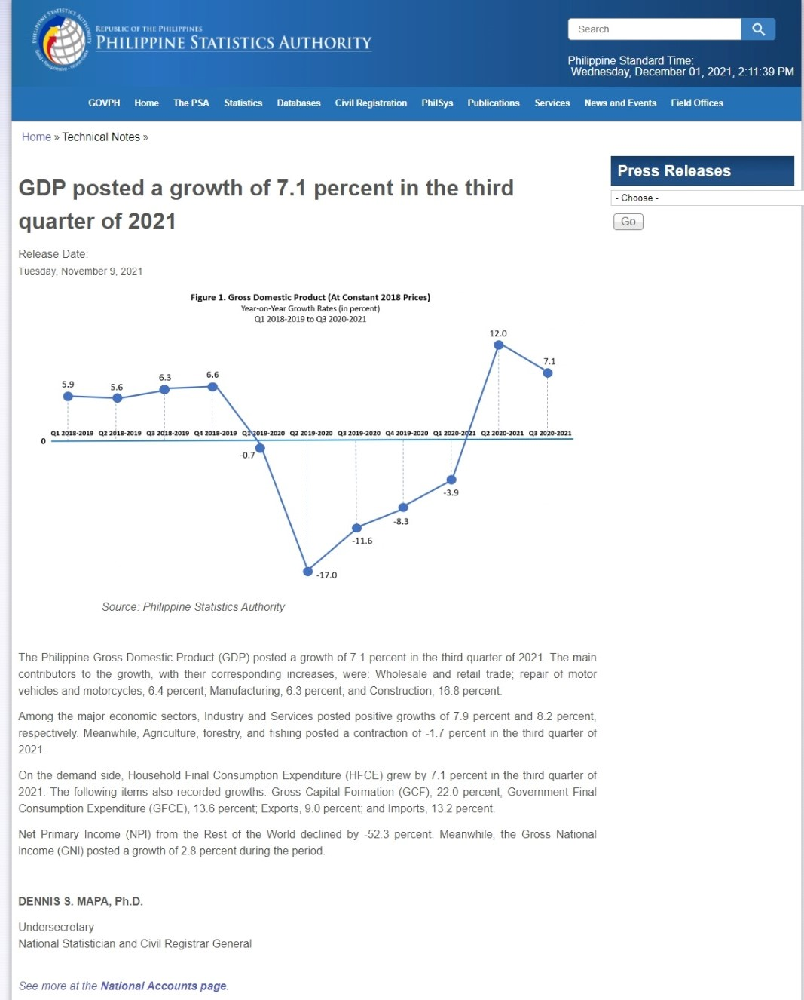
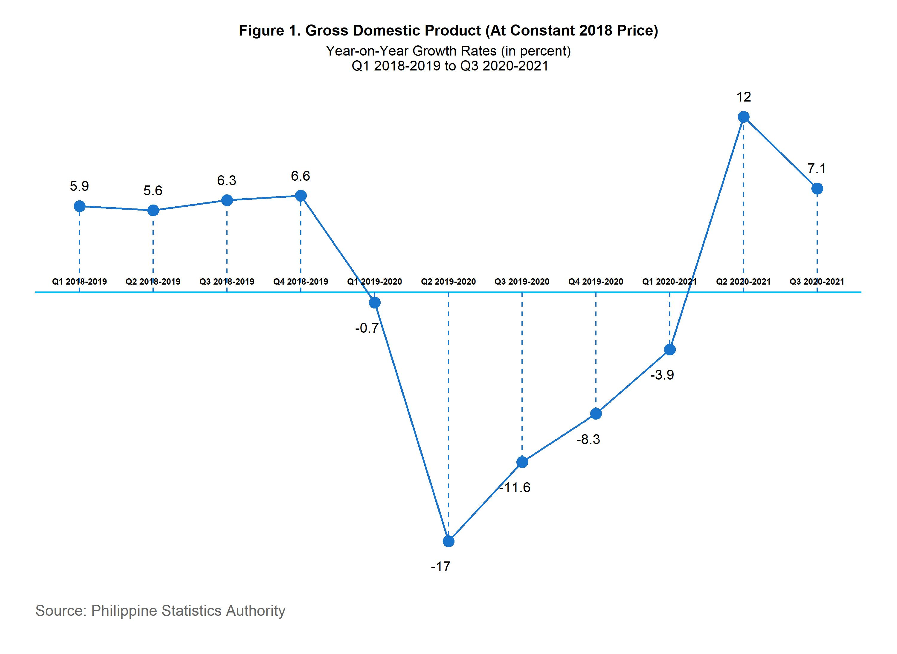
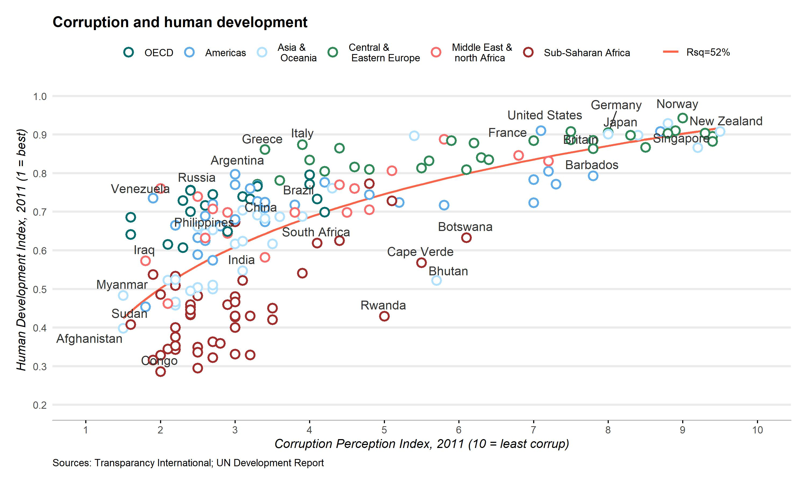

layout: true

```{r meta, echo=FALSE}
# libraries
pacman::p_load(knitr, tidyverse, metathis)
theme_set(theme_minimal())

#change directory

xaringanExtra::use_share_again()
xaringanExtra::style_share_again(share_buttons = c("twitter", "facebook", "linkedin"))

meta() %>% 
  meta_name("github-repo" = "chris-allones/training-data-viz") %>% 
  meta_social(
    title = "Data viz with ggplot2",
    description = "Training Workshop on Data Visualization using ggplot2 in R.",
    url = "https://chris-allones.github.io/data-viz-ggplot2/index.html",
    image = "https://chris-allones.github.io/data-viz-ggplot2/images/preview.png",
    og_type = "website",
    og_author = "Christopher Llones",
    twitter_card_type = "summary_large_image",
    twitter_creator = "@Topenomics",
    twitter_site = "@Topenomics"
  )

```

```{r setup, echo=FALSE}

options(htmltools.dir.version = FALSE,
        knitr.table.format = "html")

knitr::opts_chunk$set(
  fig.width=9, fig.height=3.5, fig.retina=3,
  out.width = "100%",
  cache = FALSE,
  echo = TRUE,
  message = FALSE, 
  warning = FALSE,
  hiline = TRUE,
  comment = "",
  fig.retina = 3,
  fig.align = "center"
)

```

```{r xaringan-themer, echo=FALSE, warning=FALSE}
library(xaringanthemer)

xaringanExtra::use_tile_view()
xaringanExtra::use_extra_styles(hover_code_line = TRUE,
                                mute_unhighlighted_code = FALSE)

xaringanExtra::use_animate_css()
xaringanExtra::use_animate_all("fade")

style_duo_accent(
  primary_color = "#073b4c",
  secondary_color = "#2a9d8f",
  inverse_background_color = "#073b4c",
  inverse_header_color = "#fff",
  # title_slide_background_color = "#073b4c",
  title_slide_background_image = "image/background.jpg",
  title_slide_text_color = "#212529",
  text_font_size = "1.1rem"
)


```


---

## PSA: Technical Notes

Access the article here: [GDP posted a growth of 7.1 percent in the third quarter of 2021](https://psa.gov.ph/foreign-investments/technical-notes)

.code-output-scroll[
```{r echo=FALSE, out.width="70%"}

```
]


---

## PSA: Technical Notes

Access the article here: [GDP posted a growth of 7.1 percent in the third quarter of 2021](https://psa.gov.ph/foreign-investments/technical-notes)


```{r echo=FALSE, out.width="60%"}

```


---

## The Economist: Corruption and Human Development

Access the article here: [Corruption and Human Development](https://www.economist.com/blogs/dailychart/2011/12/corruption-and-development&lt;/a&gt;&lt;a)

.code-output-scroll[
```{r echo=FALSE, out.width="70%"}
knitr::include_graphics("image/The Economist.jpg")
```
]

---

## The Economist: Corruption and Human Development

Access the article here: [Corruption and Human Development](https://www.economist.com/blogs/dailychart/2011/12/corruption-and-development&lt;/a&gt;&lt;a)

```{r echo=FALSE, out.width="70%"}

```


---

class: center

## WELL DONE!


```{r echo=FALSE, out.width="70%"}
knitr::include_graphics("image/well_done.gif")
```


---

class: middle center

# Thank you!

#### Slides created via the R packages:

.leftcol[
 

### xaringan by Yihui
]

.rightcol[
 

### xaringanthemer and xaringanExtra by Garrick
]


