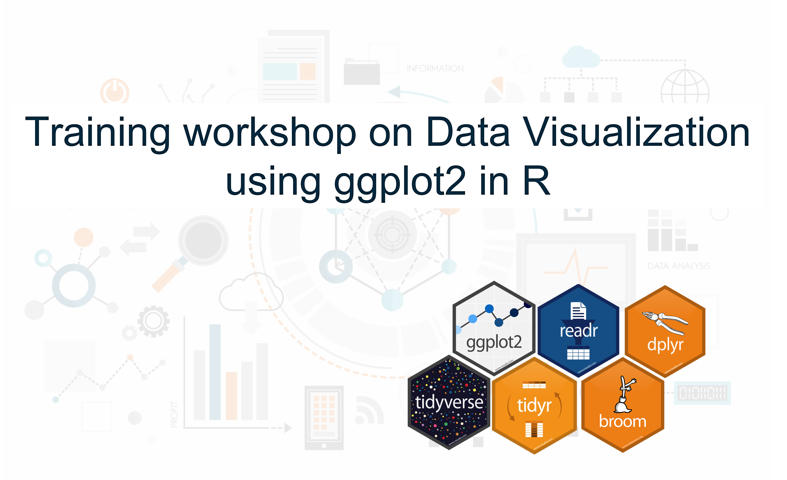

# Training Workshop on Data Visualization with ggplot2 in R

## Session 1 : Introduction to data wrangling
Topics:
- R Objects and packages
- Reading data into R
- Basic data wrangling with dplyr
- Reshaping data
- Basic management of data types
  - text data (string)
  - categorical data (factor)
  - date data

## Session 2: Understanding Grammar of graphics
Topics:
- Foundation of grammar of graphics
- Datasets and mappings
- Geometries
- Statistical transformation and plotting distribution
- Position adjustment and scales
- Coordinates and themes
- Facets and custom plots

## Session 3: Creating plots and ggplot2 extensions
Topics:
- APA style plots
  - Line plot
  - Box plot
  - Bar plot
  - Scatter plot
- Visualizing data
  - Lollipop
  - Dumbbell plot
  - Bar graph
  - Bubble plot
  - World cloud
  - Heat map

## Session 4: Challenge: recreating graphics
